# 🔌 Websocket 客户端配置指南

> **📖 本文档是 [README.md](README.md) 的补充文档**  
> 如果你还没有安装和启动 LMArena-API 应用，请先阅读 [README.md](README.md) 中的「🚀 30 秒快速开始」部分。

---

## 📋 文档说明

本文档专门介绍如何配置**Websocket 客户端**（通过浏览器油猴脚本实现），这是连接 LMArena 网站和本地 API 服务的另一种方式。

### ⚖️ 两种客户端模式对比

LMArena-API 支持两种客户端模式，**你只能选择其中一种**：

| 特性 | 网页客户端（应用内置） | Websocket 客户端（油猴脚本） |
|------|---------------------|---------------------------|
| **配置难度** | ⭐ 简单，一键创建 | ⭐⭐ 需要安装浏览器扩展 |
| **人机校验** | ⚠️ 容易触发 | ✅ **有效降低触发率** |
| **稳定性** | ✅ 稳定 | ✅ 稳定 |
| **并发支持** | ✅ 支持 | ✅ 支持 |
| **推荐场景** | 快速上手，日常使用 | 高频调用，避免人机校验 |

### 🎯 Websocket 客户端的优势

**核心优势：有效降低触发人机校验**

- ✅ **更自然的浏览器行为**：通过油猴脚本在真实浏览器环境中运行，模拟真实用户操作
- ✅ **降低风控风险**：相比应用内置的网页客户端，Websocket 客户端更不容易被平台识别为自动化行为
- ✅ **适合高频调用**：如果你需要频繁调用 API 或批量处理任务，Websocket 客户端是更好的选择

### 📝 适用场景

**推荐使用 Websocket 客户端的情况：**
- ✅ 需要频繁调用 API，担心触发人机校验
- ✅ 遇到 403 错误（人机验证）的频率较高
- ✅ 需要批量处理大量请求
- ✅ 希望获得更稳定的使用体验

**推荐使用网页客户端的情况：**
- ✅ 快速上手，不想配置浏览器扩展
- ✅ 偶尔使用，调用频率不高
- ✅ 希望使用应用内置的便捷功能

**前置条件：**
- ✅ 已下载并启动 LMArena-API 应用（参考 [README.md](README.md)）
- ✅ **不需要**在应用中创建网页客户端（两种模式二选一）
- ✅ 已安装支持油猴脚本的浏览器（Chrome、Edge、Firefox 等）

---

## 🚀 快速开始

### 选择 Websocket 客户端模式的步骤

1. **启动应用** → 运行 LMArena-API（参考 [README.md](README.md)）
2. **不要创建网页客户端** → 跳过应用中的「网页客户端」创建步骤
3. **安装油猴脚本** → 按照下面的「环境配置」部分安装脚本
4. **启动服务** → 在应用的「服务控制」页面点击「启动服务」
5. **验证连接** → 在浏览器中访问 LMArena，确认脚本正常运行

✅ 完成！现在你使用的是 Websocket 客户端模式，可以有效降低人机校验的触发率。

---

## 🛠️ 一、环境配置

**油猴(Tampermonkey)** 是一个浏览器扩展程序管理器，它允许我们在网页中运行自定义的 JavaScript 脚本。在本项目中，我们需要通过油猴脚本来：

+ 📡 与 LMArena 网站进行交互
+ 🔄 拦截和转发 AI 对话请求
+ 🔗 建立浏览器与本地 API 服务的连接

### 1.1 安装油猴插件（以 Chrome 为例）

> **💡 提示:** 其他浏览器（Edge、Firefox 等）的安装步骤类似

#### 步骤 1: 打开浏览器扩展管理页面

在 Chrome 浏览器地址栏输入:

```plain
chrome://extensions/
```

或者点击浏览器右上角 **三个点 → 扩展程序 → 管理扩展程序**

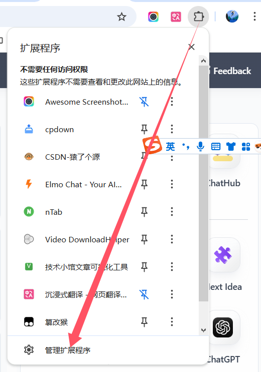

#### 步骤 2: 启用开发者模式

在扩展程序页面的 **右上角**，找到并打开 **"开发者模式"** 开关。

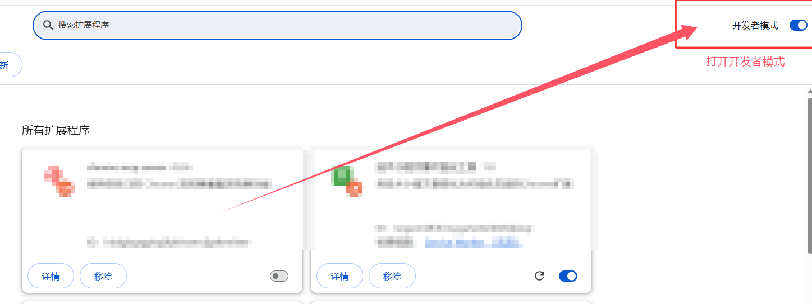

> **❓ 为什么需要开发者模式?**  
> 开发者模式允许我们安装未上架到 Chrome 应用商店的扩展，并提供更多调试功能。

#### 步骤 3: 下载并安装 Tampermonkey

1. 访问 [Tampermonkey 官方网站](https://www.tampermonkey.net/)
2. 点击对应浏览器的下载按钮
3. 在浏览器商店页面点击 **"添加到 Chrome"**


#### 步骤 4: 配置扩展权限（重要！）

安装完成后，需要给 Tampermonkey 完整的权限：

1. 在扩展程序列表中找到 **Tampermonkey**
2. 点击 **"详情"** 按钮

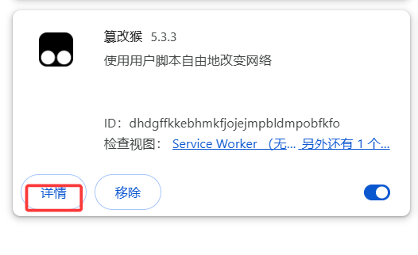

3. 往下滚动，确保以下权限都已启用：
    - ✅ **允许访问文件网址**
    - ✅ **在无痕模式下启用**
    - ✅ **允许在所有网站上**

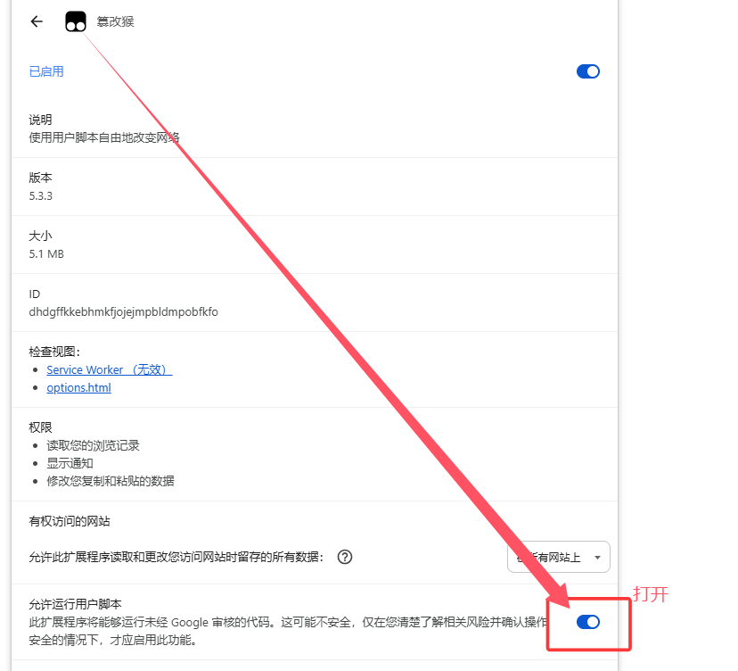

> **⚠️ 注意:** 如果权限未完全启用，脚本可能无法正常工作！

---

### 1.2 安装项目专用油猴脚本

现在我们要安装一个特殊的脚本，它是连接 LMArena 网站和本地 API 服务的桥梁。

> **💡 提示:** 脚本代码位于项目的 [`script/LMArena.js`](script/LMArena.js) 文件中，你也可以从 GitHub 仓库获取最新版本。

#### 步骤 1: 打开 Tampermonkey 管理面板

点击浏览器工具栏中的 **Tampermonkey 图标**（通常是一个黑色方块），在弹出菜单中选择 **"管理面板"**。

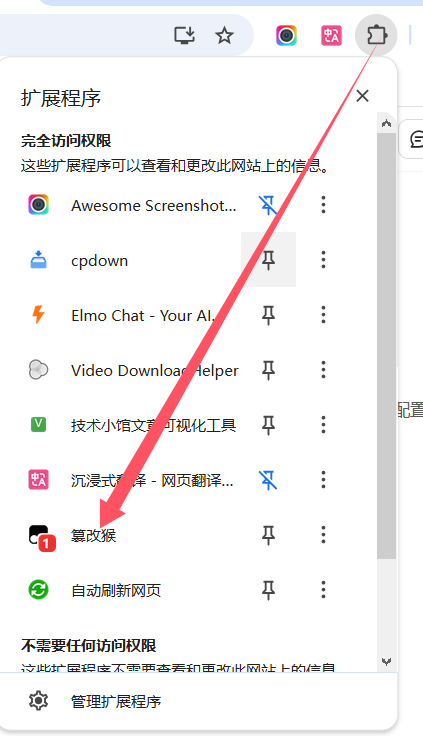

#### 步骤 2: 创建新脚本

在管理面板中，点击左侧的 **"+"** 按钮，或者点击 **"添加新脚本"**（Create a new script）按钮。

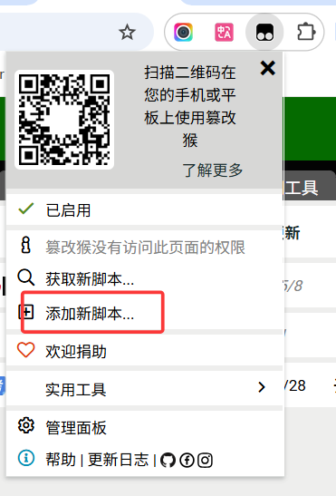

#### 步骤 3: 导入脚本代码

会打开一个代码编辑器，里面有一些默认模板代码。

**操作步骤：**

1. 按 `Ctrl + A`（全选）
2. 按 `Delete`（删除原有内容）
3. 复制 [`script/LMArena.js`](script/LMArena.js) 文件中的完整代码
4. 粘贴到编辑器中

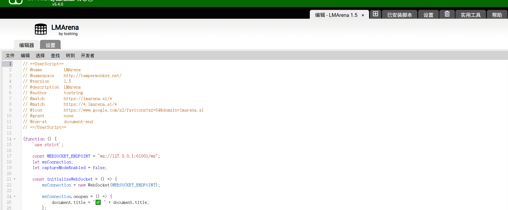

> **📝 获取脚本代码：**
> - 点击 [`script/LMArena.js`](script/LMArena.js) 打开文件，复制完整代码
> - 或从 [GitHub 仓库](https://github.com/jtostrings/LMarenaBridge) 获取最新版本

#### 步骤 4: 保存脚本

点击编辑器左上角的 **"文件"** → **"保存"**，或者直接按 `Ctrl + S`。

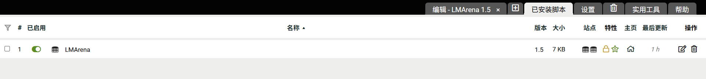

> **✅ 成功标志:** 如果保存成功，脚本名称前会显示绿色的 ✓ 符号

#### 步骤 5: 验证脚本是否生效

现在我们来测试一下脚本是否正常工作：

1. 打开一个新标签页，访问 [https://lmarena.ai/](https://lmarena.ai/)
2. 在聊天框中输入任意内容（比如 "你好"）
3. 点击发送按钮


**如何判断脚本已经运行？**

+ 按 `F12` 打开浏览器开发者工具
+ 切换到 **"控制台"**（Console）标签
+ 如果看到类似 `[LMArena API] Connecting to ws://127.0.0.1:61001/ws...` 的日志，说明脚本已经在运行

> **⚠️ 注意:** 
> - 此时连接会失败是正常的，因为本地服务可能还没有启动
> - 如果应用已启动但连接失败，请检查应用中的「服务控制」页面，确认服务状态
> - 更多问题排查请参考本文档的「常见问题」部分

---

## ⚡ 二、高级功能 - 多客户端并发

### 2.1 什么是多客户端并发？

**核心原理：**

创建多个 Websocket 客户端可以提高并发处理能力。系统会将新的会话请求自动分配给不同的客户端，实现并行处理。

**工作原理：**

+ 🚀 **负载均衡**：当有多个 API 请求时，系统会自动将请求分配给不同的客户端
+ 📊 **并行处理**：多个客户端可以同时处理不同的请求，大幅提高 API 吞吐量
+ 🔄 **会话隔离**：每个会话的内容保存在对应的客户端中，不会跨客户端共享

**重要提示：**

> ⚠️ **会话隔离说明**  
> 每个会话的内容依然保存在对应的客户端中，不会跨客户端共享。这意味着：
> - 如果你在客户端 A 中开始了一个对话，后续的请求会继续发送到客户端 A
> - 不同客户端的对话历史是独立的
> - 如果需要切换会话，需要确保使用同一个客户端

**适用场景：**

+ ✅ 需要同时处理多个独立的对话
+ ✅ 需要提高 API 调用频率和吞吐量
+ ✅ 需要运行批量任务或并发测试

> **💡 优势提示:** Websocket 客户端配合多客户端并发使用，既能提高性能，又能有效降低人机校验的触发率，是高频调用的最佳选择。

### 2.2 如何开启多个 Websocket 客户端

要启用多客户端并发，你需要打开多个 LMArena 网页标签，每个标签页都是一个独立的客户端。

**方法一: 使用浏览器无痕模式** _(简单，但不推荐)_

1. 打开一个普通标签页访问 `https://lmarena.ai/`
2. 按 `Ctrl + Shift + N`（Chrome/Edge）或 `Ctrl + Shift + P`（Firefox）打开无痕窗口
3. 在无痕窗口中再次访问 `https://lmarena.ai/`
4. 重复步骤 2-3，可以开启更多客户端

**每个新客户端都需要：**

+ ✅ 同意 LMArena 使用条款
+ ✅ 发送任意一条测试消息（确保会话建立）

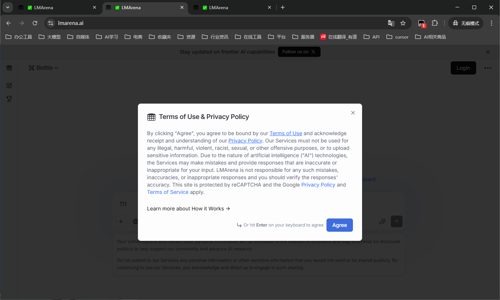


**方法二: 使用 Firefox Multi-Account Containers 插件** _(强烈推荐！)_

**为什么推荐？**

+ ✅ 不需要开启多个窗口，在同一窗口用不同标签页即可
+ ✅ 每个容器都有独立的 Cookie 和会话
+ ✅ 可以用不同颜色标识，管理更方便
+ ✅ 容器会话持久化，关闭后重开仍然保持登录

**安装步骤：**

1. 使用 **Firefox 浏览器**（这是 Firefox 专属插件）
2. 访问 [Firefox Add-ons](https://addons.mozilla.org/)
3. 搜索 **"Multi-Account Containers"**
4. 点击 **"添加到 Firefox"**

**使用方法：**

1. 安装后，浏览器右上角会出现容器图标
2. 点击图标，创建多个容器（如 "LMArena-1", "LMArena-2", "LMArena-3"）

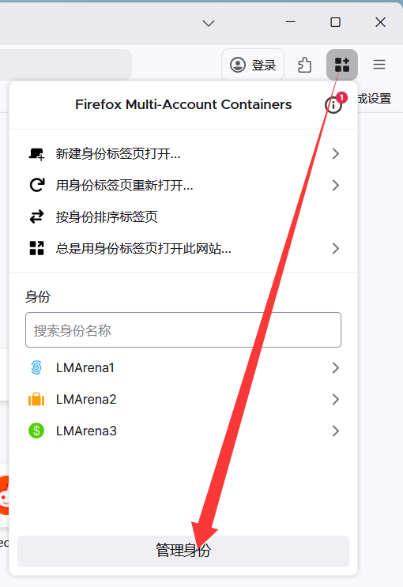

3. 在每个容器中打开 `https://lmarena.ai/`
4. 每个容器都是独立的客户端

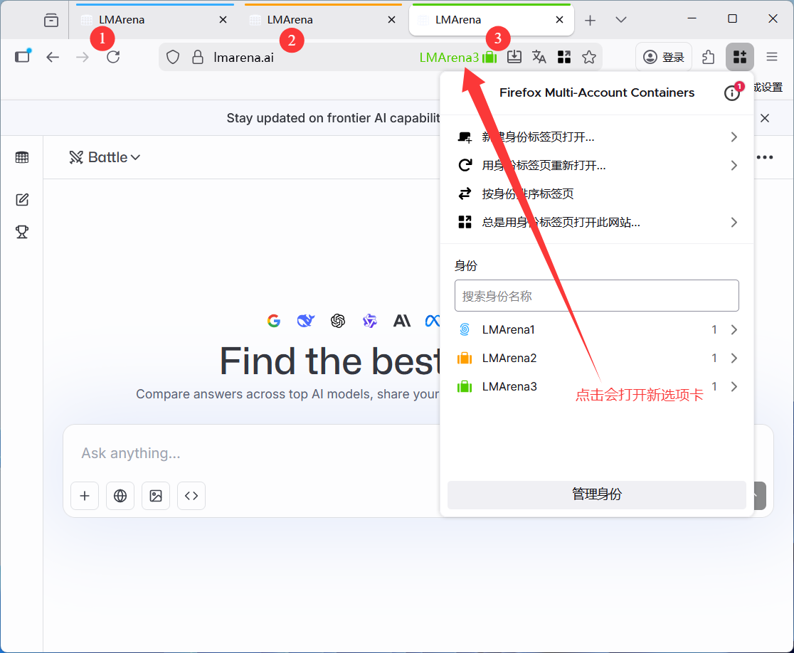

**开启会话恢复**

+ 勾选"**打开上次打开的窗口和标签页**"这个选项

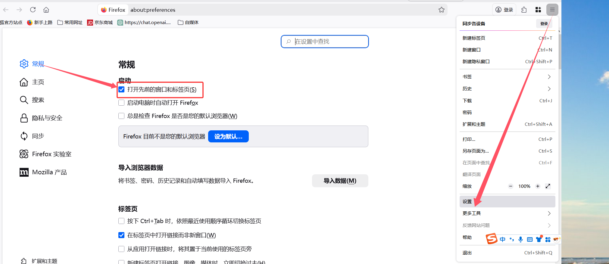

**关闭浏览器的正确方式**

+ **重要:** 关机前，不要一个个点击关闭标签页
+ 直接点击浏览器窗口右上角的"**X**"关闭整个浏览器，或者直接关机也可以

**重新打开浏览器**

+ 下次打开火狐浏览器时，之前的所有标签页会**自动恢复**

**使用建议：**

+ ✅ 根据实际需求选择合适的客户端数量，不要盲目开启太多
+ ✅ 每个客户端都会占用一定的浏览器资源，建议根据电脑性能调整
+ ✅ 定期检查客户端状态，确保所有客户端正常运行

> **💡 提示:** 关于并发处理的更多信息，请参考 [README.md](README.md) 中的「如何提高并发处理能力？」部分。

---

## ❓ 三、常见问题与解决方案

### 问题 1: 油猴脚本显示 "连接失败"

**可能原因：**

+ 本地服务未启动
+ 端口被占用
+ 防火墙拦截

**解决方法：**

1. ✅ 确认应用正在运行（检查任务栏或应用程序列表）
2. ✅ 在应用的「服务控制」页面，确认服务已启动
3. ✅ 检查应用日志，查看是否有错误信息
4. ✅ 检查防火墙设置，允许程序访问网络
5. ✅ 尝试重启服务

> **📖 相关阅读:** 更多启动问题请参考 [README.md](README.md) 中的「安装与启动」部分。

### 问题 2: 429 错误 - "请求次数过多"

**这是什么？**

LMArena 平台对每个会话有请求频率限制。如果短时间内发送太多请求，会触发 429 错误。

**解决方法：**

**方法 1: 在 AI 客户端新建会话** _(最简单快捷)_

在 AI 客户端（如 Cherry Studio、Roo Code 等）中新建一个会话，继续提问。

+ ✅ **优点**：最简单快捷，无需任何配置
+ ✅ **原理**：新建会话会使用不同的客户端，自动绕过频率限制
+ ✅ **适用**：所有使用 LMArena-API 的 AI 客户端

> **💡 提示:** 这是最推荐的解决方法，因为系统会自动将新会话分配给不同的 Websocket 客户端，无需手动操作。

**方法 2: 清除 Cookie**

1. 在 LMArena 网页上按 `F12` 打开开发者工具
2. 切换到 **"应用"**（Application）或 **"存储"**（Storage）标签
3. 找到 **Cookies** → `https://lmarena.ai`
4. 点击 **"清除所有 Cookie"**
5. 刷新页面，重新同意用户条款

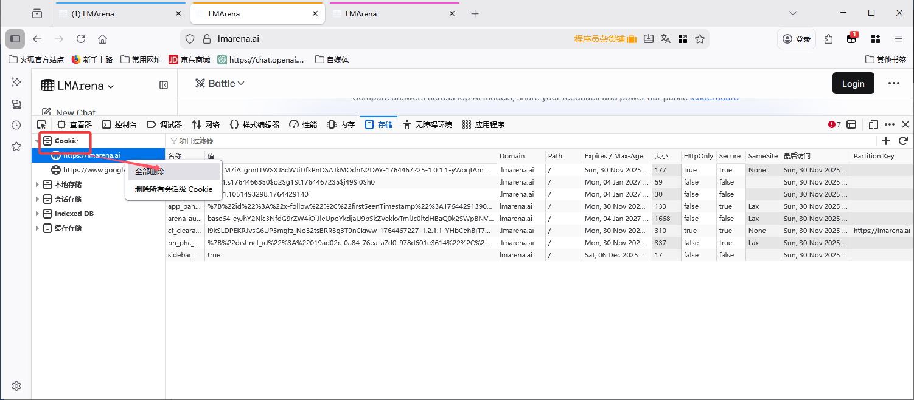

**方法 3: 更换客户端**

如果你开启了多个客户端：

1. 关闭触发 429 错误的标签页
2. 打开新的容器或无痕窗口
3. 重新访问 LMArena
4. 系统会自动将新请求分配给其他可用的客户端

**方法 4: 等待冷却**

有时候需要等待 10-20 分钟，限制会自动解除。

### 问题 3: 模型列表为空

**可能原因：**

+ 网络连接问题
+ LMArena 网站更新
+ Websocket 客户端未正确初始化

**解决方法：**

1. 在应用的「模型管理」页面点击 **"更新模型列表"** 按钮(确保服务已经成功启动)
2. 确认浏览器中 LMArena 页面已加载完成
3. 确认已安装并启用了油猴脚本
4. 在 LMArena 页面中发送至少一条消息，确保会话建立
5. 尝试重启服务

> **💡 提示:** 如果使用 Websocket 客户端模式，不需要在应用中创建网页客户端。确保浏览器中的 LMArena 页面正常运行即可。

### 问题 4: 图片上传失败

**可能原因：**

+ Action ID 过期

**解决方法：**

1. 在 LMArena 网页中手动上传一张图片
2. 油猴脚本会自动捕获新的 Action ID
3. 重新尝试 API 调用

### 问题 5: 遇到 403 错误

**可能原因：**

+ 触发了人机验证（虽然 Websocket 客户端能有效降低触发率，但在极端情况下仍可能触发）

**解决方法：**

1. **在浏览器中手动完成验证**
   - 在触发验证的 LMArena 标签页中，按照提示完成人机验证
   - 验证完成后，刷新页面即可恢复使用

2. **更换客户端**
   - 如果当前客户端频繁触发验证，可以关闭该标签页
   - 打开新的浏览器标签页或容器，重新访问 LMArena
   - 重新完成条款同意和初始化

3. **切换到 Websocket 客户端模式**
   - 如果你之前使用的是应用内置的网页客户端，可以尝试切换到 Websocket 客户端模式
   - Websocket 客户端能有效降低人机校验的触发率

> **💡 提示:** Websocket 客户端的优势之一就是能有效降低触发人机校验的概率。如果你经常遇到 403 错误，建议使用 Websocket 客户端模式。

---

## 🎓 四、使用建议与最佳实践

### ✅ 推荐做法

1. **保持浏览器标签页打开**  
   只要在使用 API，就不要关闭 LMArena 的标签页

2. **定期查看服务日志**  
   在应用的日志面板中查看，有助于及时发现问题

3. **合理设置客户端数量**  
   根据实际需求，不要盲目开启太多客户端。每个客户端都会占用资源，建议根据电脑性能调整

4. **使用 Firefox 容器管理多会话**  
   比无痕模式更稳定和方便

5. **定期更新脚本**  
   从 GitHub 仓库获取最新版本的 [`script/LMArena.js`](script/LMArena.js)，确保兼容性

6. **避免频繁切换客户端模式**  
   网页客户端和 Websocket 客户端只能二选一，频繁切换可能导致配置混乱

### ❌ 避免的操作

1. **不要在短时间内发送大量请求**  
   容易触发 429 限流

2. **不要暴露你的 API 到公网**  
   这是本地服务，仅供个人使用

3. **不要关闭应用但保持浏览器标签页打开**  
   会导致连接失败，浪费资源

4. **不要同时使用两种客户端模式**  
   网页客户端和 Websocket 客户端只能二选一，同时使用可能导致冲突

---

## 🔗 相关文档

- [README.md](README.md) - 主文档，包含完整的安装和使用指南
- [GitHub 仓库](https://github.com/jtostrings/LMarenaBridge) - 获取最新版本和脚本代码

